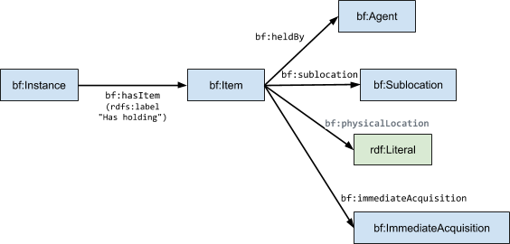
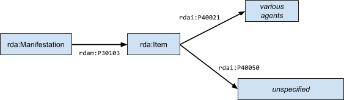
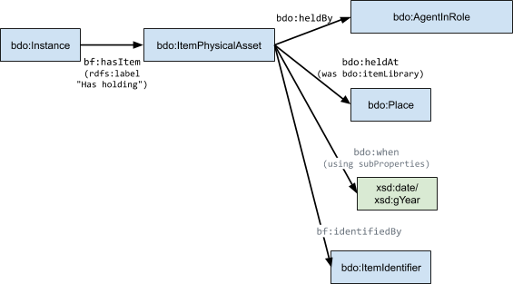

## Holdings Model

### Purpose

Holdings represent information about a physical item in terms of

  - the _organization or individual that controls_ the item;
  - _where the item resides_ such as a monastery, library, or residence;
  - if appropriate, _where the item is located within the containing
    place_, e.g. a shelf location;
  - if known, _when the item was acquired_;
  - _how the item was acquired_, such as bequeathal, purchase, discovery,
    and so on

A holding may be considered to be similar to an element of the
provenance or chain of custody of an item; however, such a chain of
custody is not modeled here. We defer treatment of a Provenance model
until we have sources of custodial information that warrant such a
model.

### Use Cases

The following illustrate some of the data that will be captured by the
Holdings model:

1.  The Nepal German Manuscript Preservation Project (NGMPP) has
    collected holding information for each manuscript including the
    holder of the manuscript, where the manuscript was located, and when
    the manuscript was acquired at the time the manuscript was cataloged
    and digitized
2.  The Tibetan Library Management (TLM) project has collected holding
    information for a variety of items that reside in monastic libraries
    including the location of the library, the identity of the monastic
    tradition, and shelving information. For the TLM project there is no
    information about when the item was acquired by the library.

Additional use cases will likely require no additional properties, and
so we consider these use cases to be definitive for the current needs of
a Holding Model.

### Related Modeling

#### Bibframe 2 modeling

The following diagram summarizes holdings related modeling in Bibframe
2:

#####  Comments:

  - The label on `bf:hasItem` and its inverse `bf:itemOf` indicates that, at
    least in the context of these properties, an `bf:Item` is considered to
    represent a holding by the `bf:Agent` of the `bf:heldBy` property. Such an
    `bf:Item` in the current Bibliographic model is a `bdo:ItemPhysicalAsset`.
  - `bf:Sublocation` is an unspecified Class - "`Specific place within the
    holding entity where the item is located or made available.`". No
    properties are defined with an `rdfs:domain` of `bf:Sublocation`.
  - The target of the `bf:physicalLocation` property is an unspecified
    `rdfs:Literal` - "`Location in the holding agency where the item is
    shelved or stored.`".
  - `bf:immediateAcquisition` maps a `bf:Item` to a `bf:ImmediateAcquisition`;
    however, the class `bf:ImmediateAcquisition` has no properties defined
    on its individuals. There is only the `skos:definition` "`Information
    about the circumstances, e.g., source, date, method, under which the
    resource was directly acquired.`".

#### RDA Modeling

Some liberty will be taken in describing the RDA modeling since there
are many repetitive properties for different sorts of _Agents_ that we
model via subclasses (in concert with Bibframe) rather than via families
of sub properties. The following highlights the structure of the RDA
model w.r.t. holdings:

##### Comments:

  - `rda:Manifestation` corresponds to `bf:Instance`
  - The property `rdam:P30103` "`Relates a manifestation to an item that is
    a single instance of a manifestation.`"
  - The property `rdai:P40021`, "`has owner agent`", "`Relates an item to an
    agent who has current or former legal possession of an item.`". The
    sub-property `rdai:P40018`, "`has current owner agent`", corresponds to
    `bf:heldBy` and has sub-properties defined that correspond to various
    subclasses of `bf:Agent` such as a single Person, Family, Collective
    Organization and such.
  - The property `rdai:P40050` "`Relates an item to the circumstances under
    which an item is directly acquired, including a method, source, and
    date of acquisition.`"; and is otherwise unspecified as there are no
    object classes or datatypes defined as possible ranges that would
    represent the when, method and so on.

The RDA model via sub-properties of `rdai:P40018` suggests some agent role
ideas such as:

  - `rdai:P40006`, "`has depositor agent`", "`Relates an item to an agent who
    is a current owner of an item who deposits the item into the custody
    of another agent without transferring ownership.`"; and
  - `rdai:P40007`, "`has donor agent`", "`Relates an item to an agent who is
    a former owner of an item who donates the item to another owner.`".

From the RDA model we can consider three roles: owner, depositor, and
donor which will likely arise in Buda.

### Proposed Model

We generally follow an approach of extending applicable
[Bibframe 2](https://www.google.com/url?q=https://github.com/buda-base/owl-schema/blob/evolving/sources/bibframe-2-20190109.ttl&sa=D&ust=1581871077945000) modeling.
The Bibframe 2 model associates holding information with a physical item
which we model as an extension of `bf:Item ⇒ bdo:Item ⇒
bdo:ItemPhysicalAsset`; and constrain via Shacl shapes.

##### Comments:

Several points need to be made:

  - We want to accommodate the roles as mentioned above in the overview
    of the RDA modeling, so rather than using `bf:heldBy` we define
    `bdo:heldBy` to have a range of `bdo:AgentInRole` which allows us to
    associate agents in various capacities in the holding information
    for an `bdo:ItemPhysicalAsset`.
  - In RDA and Bibframe an un(der)specified class is associated with
    holding or acquisition information such as when, where and how an
    Item came to be associated with its `bdo:Instance`. Thus we use
    `bdo:when` and `bdo:heldAt` and do not specify any modeling for how, since we currently have no data of this sort.
  - The `bf:identifiedBy` will be constrained via a shape to
    `bdr:ItemIdentifier` which includes for example:  
        bf:ShelfMarkLcc a skos:Concept ;  
            skos:broader bdr:ShelfMark .  
        bdr:ShelfMark a skos:Concept ;  
            skos:broader bdr:ItemIdentifier .  
    This is sufficient to capture the idea of a `bf:Sublocation` or
    `bf:physicalLocation`.
